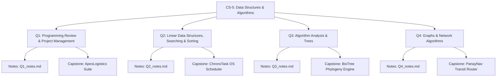

# CS-5: Data Structures and Algorithms — Course Outline & Curriculum Guide
**Philippine Science High School — Western Visayas Campus**  
**School Year 2026–2027 | Credit Units: 1.7 | Meetings: 5 / week**  
**Course Code:** CS5 | **Grade Level:** Grade 11 / 12  
**Subject Teacher:** Gerald U. Salazar | **Unit Head:** Rubie Anne G. Bito-on | **CID Chief:** Virginia A. Barlas  

---

---

## 📊 Course Grading System

| Assessment Component | Weight | Description |
|---|---|---|
| **Long Test 1 (Mid-Quarter Exam)** | **25%** | Rigorous pen-and-paper / on-screen assessment of theoretical foundations, trace tables, and algorithmic analysis. |
| **Long Test 2 (Quarterly Final Exam)** | **25%** | Comprehensive cumulative examination covering theoretical synthesis and advanced problem-solving. |
| **Alternative Assessment (Quarter Project)** | **25%** | Portfolio-grade software engineering capstone project synthesizing all concepts of the quarter. |
| **Formative Assessments & Machine Problems (MPs)** | **25%** | Weekly hands-on lab exercises, coding challenges, machine problems, and code reviews. |

---

# 📅 Detailed Scope & Sequence with Machine Problems & Projects

---

## 🟢 FIRST QUARTER: Review of Programming Concepts & Project Management

### Quarter Focus & Philosophy
Re-establish foundational algorithmic thinking using Python 3, bridge the gap between ad-hoc scripting and disciplined software engineering, instill industry-standard defensive programming and input validation, and introduce Agile project management practices.

### Quarter 1 Big Project (Alternative Assessment — 25%)
> **Project Title:** **`ApexLogistics: Enterprise Cargo & Courier Dispatch Management System`**  
> **Overview:** A terminal-based enterprise management suite simulating an inter-island and international courier hub (similar to DHL/LBC/2GO).  
> **Key Integrated Topics:** Multi-tier pricing matrices, user authentication, robust input sanitization loops, nested data structures, modular function libraries, receipt generation with exact decimal formatting, and Agile sprint documentation (Kanban/User Stories/Git commit logs).  
> **Core Deliverables:**
> 1. Complete multi-file Python application (`main.py`, `pricing.py`, `validators.py`, `reporting.py`).
> 2. Software Requirements Specification (SRS) & Agile Project Board (Sprint backlog, User stories with acceptance criteria).
> 3. Comprehensive test suite testing boundary shipping weights, discount vouchers, priority surcharges, and invalid inputs.

---

### Q1 Weekly Lesson Breakdown & Accompanying Machine Problems

#### Lesson 1.1: Project Management Concepts & Professional Python Development Workflow
* **Subtopics:** Software Development Life Cycle (SDLC), Agile/Scrum fundamentals for student developers, User Stories & Acceptance Criteria, Git version control (init, commit, branching, merging), PEP-8 style guide, virtual environments.
* **Competencies:** Deconstruct complex problem statements into granular user stories; set up reproducible development environments; establish Git-based collaborative workflows.
* **Accompanying Mini-Project (MP 1.1):** **`Agile Kanban & Issue Tracker CLI`**
  * *Scenario:* Create a CLI sprint tracker that allows a developer to log tickets, assign priority levels (Low, Med, High, Critical), move tickets across columns (`Backlog` -> `In Progress` -> `QA` -> `Done`), and compute sprint completion velocity.

#### Lesson 1.2: Variables, Primitive Types, Dynamic Typing & Type Casting Internals
* **Subtopics:** Variables as object references, memory id (`id()`), primitive types (`int`, `float`, `str`, `bool`), type casting (`int()`, `float()`, `str()`), numeric precision caveats (floating-point IEEE 754 precision, integer truncation vs rounding).
* **Competencies:** Analyze type casting implications; mitigate precision errors in financial/scientific computations; implement strict input parsing.
* **Accompanying Machine Problem (MP 1.2):** **`Precision Currency & Scientific Converter`**
  * *Scenario:* Implement a multi-unit scientific converter (Energy: Joules, Calories, kWh; Currency with fluctuating exchange rates) that enforces round-off guarantees, checks against underflow/overflow anomalies, and outputs exact floating formatting (`:.4f`, `:.2f`).

#### Lesson 1.3: Operators, Expressions & Short-Circuit Evaluation
* **Subtopics:** Arithmetic (`//`, `%`, `**`), Relational & Chained comparisons (`0 <= x <= 100`), Logical (`and`, `or`, `not`), Operator precedence, Short-circuit evaluation mechanics, Bitwise operators (`&`, `|`, `^`, `~`, `<<`, `>>`).
* **Competencies:** Construct minimal, boolean-optimized conditional expressions; leverage short-circuiting to prevent `ZeroDivisionError` and `NoneType` attribute crashes.
* **Accompanying Machine Problem (MP 1.3):** **`Automated Loan & Insurance Risk Assessor`**
  * *Scenario:* Build a financial underwriting decision engine that accepts applicant debt-to-income ratio, credit score, employment stability index, and collateral valuation. Utilize chained comparisons and short-circuit boolean expressions to categorize risk (`Approved`, `Conditional Review`, `Rejected`).

#### Lesson 1.4: Advanced Control Structures: Branching & Defensive Loop Architecture
* **Subtopics:** Nested `if-elif-else` trees, sentinel-controlled loops, indefinite `while True` loops with `break` and `continue`, loop `else` clauses, accumulator patterns, defensive input validation with `try-except ValueError`.
* **Competencies:** Design crash-proof console interfaces that withstand arbitrary invalid inputs; construct deterministic loops with termination guarantees.
* **Accompanying Machine Problem (MP 1.4):** **`Smart Taxi & Courier Fare Meter (Enhanced)`**
  * *Scenario:* A real-time dispatch meter computing flag-down rates, distance-stepped billing, idle/waiting time surcharges, peak-hour multipliers, and passenger discounts (Senior Citizen, PWD, Student). All user entries must be trapped in defensive validation loops.

#### Lesson 1.5: Modular Programming, Functions & Scope (LEGB)
* **Subtopics:** Function anatomy, pure functions vs side-effects, positional and keyword arguments, default parameters, variable-length arguments (`*args`, `**kwargs`), returning multiple values (tuples), Scope resolution (Local, Enclosing, Global, Built-in), Docstrings and Type Hinting (`typing`).
* **Competencies:** Refactor monolithic code into decoupled, single-responsibility functions; document APIs using Sphinx/Google docstring standards; prevent global namespace pollution.
* **Accompanying Machine Problem (MP 1.5):** **`KapeTayo Point-of-Sale (POS) Modular Engine`**
  * *Scenario:* Expand the café POS system into a decoupled architecture: dedicated functions for catalog retrieval, order batch processing, tax computation (12% VAT), discount verification, and itemized receipt rendering with formatted tabular outputs.

#### Lesson 1.6: Complex Built-In Data Structures (Lists, Tuples, Dictionaries & Sets)
* **Subtopics:** List mutations (`append`, `extend`, `pop`, `insert`, slicing `[::-1]`), List comprehensions, Immutable tuples as record types, Dictionaries for $O(1)$ key lookups, Set operations (unions, intersections, symmetric differences), nested JSON-like records.
* **Competencies:** Select the optimal built-in collection for diverse problem constraints; process multi-dimensional tabular datasets.
* **Accompanying Mini-Project (MP 1.6):** **`Inventory SKU & Reorder Alert Engine`**
  * *Scenario:* An inventory management script storing warehouse SKUs inside nested dictionaries. Supports restocking transactions, item lookups, low-stock threshold alerting using set differences, and sales revenue aggregations using comprehensions.

---

## 🔵 SECOND QUARTER: Fundamental Data Structures, Linear Data Structures, Searching & Sorting

### Quarter Focus & Philosophy
Transition from built-in Python idioms to fundamental, low-level data structure design. Scholars implement Abstract Data Types (ADTs) from scratch, master pointer/reference manipulation, and explore sorting and searching algorithms with empirical and structural rigor.

### Quarter 2 Big Project (Alternative Assessment — 25%)
> **Project Title:** **`ChronoTask: Real-Time Operating System Task Scheduler & Memory Manager`**  
> **Overview:** A simulation of an OS kernel process scheduler and undoable text-buffer editor built purely from custom data structures (no built-in Python list methods for queueing).  
> **Key Integrated Topics:** Custom Doubly Linked List for active processes, Stack for multi-level Undo/Redo operations, Circular Queue for Round-Robin CPU time-slice scheduling, and Sorting/Searching algorithms for process priority ranking and PID lookup.  
> **Core Deliverables:**
> 1. Complete object-oriented implementation of `Node`, `DoublyLinkedList`, `Stack`, `CircularQueue`.
> 2. CPU execution simulator with time-slice preemption, process arrival queue, and burst-time calculations.
> 3. Performance benchmark comparing custom search/sort algorithms against standard benchmarks.

---

### Q2 Weekly Lesson Breakdown & Accompanying Machine Problems

#### Lesson 2.1: Abstract Data Types (ADTs), Contiguous Memory & Static Arrays
* **Subtopics:** Concepts of ADTs vs Data Structures, Contiguous vs Non-contiguous memory allocation, static arrays vs dynamic arrays (amortized growth strategy in Python lists), reference semantics.
* **Competencies:** Explain internal memory allocation of arrays; implement a fixed-size `StaticArray` class with boundary safety and overflow handling.
* **Accompanying Machine Problem (MP 2.1):** **`Fixed-Capacity Dynamic Array Implementation`**
  * *Scenario:* Build a custom `CustomArrayList` class supporting `append()`, `insert(index, val)`, `delete(index)`, and dynamic resizing (doubling capacity on saturation) without utilizing Python's built-in list methods.

#### Lesson 2.2: The Stack ADT (LIFO) & Applications
* **Subtopics:** Last-In First-Out (LIFO) principle, primitive operations: `push()`, `pop()`, `peek()`, `is_empty()`, `size()`, Array-based implementation, Stack Overflow & Underflow.
* **Competencies:** Implement the Stack ADT; apply stack mechanics to solve parsing, backtracking, and expression evaluation problems.
* **Accompanying Machine Problem (MP 2.2):** **`Syntax Validator & Infix-to-Postfix Converter`**
  * *Scenario:* Construct a program that parses mathematical and code expressions, verifies balanced delimiters (`()`, `[]`, `{}`), and converts infix expressions (e.g., `(A + B) * C`) to postfix Reverse Polish Notation (RPN) before computing the evaluation result.

#### Lesson 2.3: The Queue ADT (FIFO), Circular Queues & Deques
* **Subtopics:** First-In First-Out (FIFO) principle, `enqueue()`, `dequeue()`, `front()`, pitfalls of naive list queues ($O(n)$ shifts), Circular Queue buffer using modulo arithmetic (`(rear + 1) % capacity`), Double-Ended Queues (Deques).
* **Competencies:** Design bounded circular buffers; solve resource starvation and buffer management problems.
* **Accompanying Machine Problem (MP 2.3):** **`Hospital Triage & Emergency Room Circular Buffer`**
  * *Scenario:* Implement an emergency room patient dispatch queue with a fixed circular buffer. Supports regular patient admissions, critical emergency bypasses using a Deque, and service time simulation.

#### Lesson 2.4: Singly Linked Lists
* **Subtopics:** Node architecture (Data and Next pointers), dynamic memory chaining, head pointer, traversal, insertion (at head, at tail, at arbitrary position), deletion (by value, by index), edge cases (empty list, single node list).
* **Competencies:** Construct pointer-linked nodes in Python; manipulate dynamic references without data loss; trace memory states through pointer diagrams.
* **Accompanying Machine Problem (MP 2.4):** **`Music Playlist Manager (Singly Linked)`**
  * *Scenario:* Implement a music player playlist where each song is a node. Provide operations to play next song, insert track after current song, delete specific tracks, reverse playlist in $O(n)$ time and $O(1)$ auxiliary space, and detect playback loops (Floyd’s Cycle-Finding Algorithm).

#### Lesson 2.5: Doubly & Circular Linked Lists
* **Subtopics:** Bidirectional traversal with `prev` and `next` pointers, Sentinel/Dummy head and tail nodes, Circular singly and doubly linked lists, memory overhead vs traversal flexibility.
* **Competencies:** Maintain bidirectional pointer consistency during insertions and deletions; implement robust pointer updates without dangling references.
* **Accompanying Machine Problem (MP 2.5):** **`Browser Tab & Navigation History Engine`**
  * *Scenario:* Recreate a browser tab history system using a Doubly Linked List. Support visiting new URLs (clearing forward history), navigating `Back`, navigating `Forward`, and inspecting historical nodes.

#### Lesson 2.6: Search Algorithms: Linear, Binary & Jump Search
* **Subtopics:** Sequential scanning, Divide-and-Conquer search on sorted sequences, Binary Search (iterative and recursive formulations), midpoint calculation overflow prevention, Jump/Block Search.
* **Competencies:** Analyze precondition constraints for search algorithms; formulate binary search boundary conditions (`low <= high`, `mid = (low + high) // 2`); adapt binary search for finding first/last occurrences.
* **Accompanying Machine Problem (MP 2.6):** **`National ID / LRN Fast Lookup Registry`**
  * *Scenario:* Build a search utility querying 100,000 synthetic Learner Reference Numbers (LRNs). Compare search step counts and elapsed microseconds between Linear Search, Iterative Binary Search, and Jump Search across worst-case and best-case targets.

#### Lesson 2.7: Quadratic Sorting Algorithms ($O(n^2)$)
* **Subtopics:** Bubble Sort (early termination optimization), Selection Sort (unstable minimum extraction), Insertion Sort (adaptive nature, online sorting behavior), Inversion counting, Stability in sorting.
* **Competencies:** Implement, trace, and compare elementary sorts; evaluate algorithm behavior on partially sorted vs reverse-sorted arrays.
* **Accompanying Machine Problem (MP 2.7):** **`Student Gradebook Multi-Key Sorter`**
  * *Scenario:* Sort student records by General Weighted Average (GWA) and alphabetically by surname. Demonstrate stability preservation using Insertion Sort and verify instability under Selection Sort.

#### Lesson 2.8: Log-Linear Sorting Algorithms ($O(n \log n)$)
* **Subtopics:** Divide and conquer paradigm, Merge Sort (recursive division, auxiliary merge subroutine, space trade-off), Quick Sort (pivot strategies: first, last, random, median-of-three; Lomuto vs Hoare partitioning), Worst-case degradation ($O(n^2)$) avoidance.
* **Competencies:** Implement recursive divide-and-conquer sorts; trace recursion call stacks; select optimal sorting algorithms based on dataset characteristics.
* **Accompanying Machine Problem (MP 2.8):** **`Big-Data Benchmark Suite: Merge Sort vs Quick Sort`**
  * *Scenario:* Develop an automated benchmarking harness executing on random, sorted, and reverse-sorted integer arrays of size $N \in \{10^3, 10^4, 10^5\}$. Output execution time graphs and recursion depth measurements.

---

## 🟡 THIRD QUARTER: Algorithm Efficiency Analysis & Trees

### Quarter Focus & Philosophy
Equip scholars with mathematical and empirical tools to rigorously analyze algorithmic efficiency. Transition from linear structures to hierarchical, non-linear representations: Binary Trees, Binary Search Trees, and Priority Queues/Heaps.

### Quarter 3 Big Project (Alternative Assessment — 25%)
> **Project Title:** **`BioTree: Taxonomic Phylogeny & Genome Sequence Autocomplete Engine`**  
> **Overview:** A hierarchical biological data analysis system modeling species phylogenies and genetic k-mer dictionaries.  
> **Key Integrated Topics:** Tree traversals, Binary Search Tree (BST) operations with balanced pruning, Min/Max-Heap for top-k frequency extraction, and Empirical vs Theoretical Big-O complexity profiling.  
> **Core Deliverables:**
> 1. Complete implementation of custom `TreeNode`, `BinarySearchTree`, and `BinaryHeap`.
> 2. Fast interactive search querying taxonomic clades and genomic sequences.
> 3. Formal empirical analysis report plotting $N$ vs Time graphs, matching theoretical Big-O curves ($O(\log n)$, $O(n)$, $O(n \log n)$).

---

### Q3 Weekly Lesson Breakdown & Accompanying Machine Problems

#### Lesson 3.1: Empirical Analysis & Performance Profiling
* **Subtopics:** Wall-clock time vs CPU time, `time.perf_counter()`, `timeit` module, memory profiling with `tracemalloc`, hardware dependencies, variability reduction through statistical trials (mean, standard deviation).
* **Competencies:** Design controlled benchmarking experiments; profile CPU runtime and peak memory usage; generate empirical performance plots.
* **Accompanying Machine Problem (MP 3.1):** **`Empirical Performance Profiler Tool`**
  * *Scenario:* Build a profiling utility that accepts any Python function, runs it against escalating inputs ($N = 10$ to $10^6$), measures execution variance, and exports a CSV table of elapsed times and memory allocations.

#### Lesson 3.2: Theoretical Analysis & Asymptotic Growth (Big-O, Big-$\Omega$, Big-$\Theta$)
* **Subtopics:** Counting primitive operations (T(n) polynomials), Asymptotic dominance, Formal mathematical definition of Big-O ($T(n) \le c \cdot g(n)$), Big-$\Omega$ (lower bound), Big-$\Theta$ (tight bound), Standard complexity classes ($O(1), O(\log n), O(n), O(n \log n), O(n^2), O(2^n)$).
* **Competencies:** Formulate closed-form operation counts $T(n)$ for nested loops; deduce tight asymptotic bounds; mathematically classify algorithms.
* **Accompanying Machine Problem (MP 3.2):** **`Complexity Verification & Curve-Fitting Tool`**
  * *Scenario:* Write an algorithmic tester that runs known algorithms ($O(1), O(n), O(n^2)$), collects empirical data points, and uses ratio tests ($T(2N)/T(N)$) to automatically deduce the likely Big-O complexity class of an unknown black-box function.

#### Lesson 3.3: Introduction to Trees: Terminology & General Tree Representations
* **Subtopics:** Hierarchical structures, nodes, edges, root, parent, child, siblings, leaf nodes, degree, depth, height, path, subtrees, tree representations (First-Child Next-Sibling, List of Children).
* **Competencies:** Map hierarchical domain models to tree structures; compute tree structural properties (height, depth, leaf count) recursively.
* **Accompanying Machine Problem (MP 3.3):** **`Virtual UNIX File System Directory Tree`**
  * *Scenario:* Implement a CLI representing a virtual file system hierarchy. Support commands: `mkdir`, `touch`, `cd`, `ls -R` (recursive tree display with indentation), and `du` (calculating cumulative disk usage of subdirectories via post-order calculation).

#### Lesson 3.4: Binary Trees & Tree Traversal Algorithms
* **Subtopics:** Binary Tree properties (Full, Complete, Perfect, Balanced), Maximum nodes per level ($2^l$), recursive node definition, Depth-First Traversals (Pre-order, In-order, Post-order), Breadth-First Traversal (Level-order using a Queue).
* **Competencies:** Implement recursive and iterative tree traversals; reconstruct binary trees from combinations of pre-order and in-order traversal sequences.
* **Accompanying Machine Problem (MP 3.4):** **`Arithmetic Expression Tree Evaluator`**
  * *Scenario:* Build a binary expression tree from a postfix mathematical string. Traverse the tree to generate: Infix expression with minimal parentheses (In-order), Prefix expression (Pre-order), Postfix expression (Post-order), and evaluate the final arithmetic result recursively.

#### Lesson 3.5: Binary Search Trees (BST): Implementation, Insertion & Search
* **Subtopics:** The BST Invariant ($\text{left} < \text{root} \le \text{right}$), recursive vs iterative search, insertion algorithm, finding minimum and maximum keys, in-order traversal yielding sorted order.
* **Competencies:** Implement a verified BST; maintain BST invariant across all insertions; demonstrate $O(\log n)$ average vs $O(n)$ degenerate worst-case behaviors.
* **Accompanying Machine Problem (MP 3.5):** **`Student Academic Record BST Registry`**
  * *Scenario:* Implement a student database indexed by Student ID using a BST. Support fast student lookup, key insertion, printing all students in sorted ID order, and calculating the exact tree height to monitor tree balance.

#### Lesson 3.6: BST Deletion & Edge Case Management
* **Subtopics:** Deletion complexity: Case 1 (Leaf node), Case 2 (Node with one child), Case 3 (Node with two children — In-order successor vs In-order predecessor replacement), structural integrity preservation.
* **Competencies:** Execute multi-case node deletions without corrupting tree structure; implement unit tests validating pointer rewiring across all three cases.
* **Accompanying Machine Problem (MP 3.6):** **`Dynamic Inventory Deletion & Rebalancing Simulation`**
  * *Scenario:* Extend the BST registry to support robust record deletion. Simulate batch product retirements and run automated invariant checks verifying that the BST remains valid after every removal.

#### Lesson 3.7: Priority Queues & Binary Heaps
* **Subtopics:** Priority Queue ADT, Complete Binary Tree property, Array-based heap representation (parent at $\lfloor (i-1)/2 \rfloor$, children at $2i+1, 2i+2$), Min-Heap vs Max-Heap invariants, `heapify_up` ($O(\log n)$), `heapify_down` ($O(\log n)$), Build-Heap algorithm ($O(n)$).
* **Competencies:** Implement an array-backed binary heap from scratch; analyze time advantages of heaps over unsorted/sorted arrays for priority queues.
* **Accompanying Machine Problem (MP 3.7):** **`Air Traffic Control Emergency Landing Scheduler`**
  * *Scenario:* Build an air traffic priority landing system using a custom Min-Heap. Aircraft enter the priority queue with emergency fuel-level scores and passenger counts. The tower always grants landing clearance to the minimum fuel-score aircraft in $O(\log n)$ time.

---

## 🔴 FOURTH QUARTER: Graphs & Network Algorithms

### Quarter Focus & Philosophy
Explore general graph theory modeling pairwise relationships. Master fundamental graph representations (Adjacency Matrices and Adjacency Lists), comprehensive traversals (BFS, DFS), shortest path computation, and minimum spanning trees applied to network infrastructures.

### Quarter 4 Big Project (Alternative Assessment — 25%)
> **Project Title:** **`PanayNav: Western Visayas Inter-City Transit & Emergency Logistics Router`**  
> **Overview:** A real-world geographic routing network modeling Panay Island transit connections (Iloilo City, Roxas City, Kalibo, San Jose de Buenavista, and connecting municipalities).  
> **Key Integrated Topics:** Graph representation using Adjacency Lists, Breadth-First Search (fewest transfers), Dijkstra's Algorithm (fastest travel time with weighted roads), Prim's or Kruskal's Algorithm (minimum cost optical-fiber / relief-route network), and Cycle Detection.  
> **Core Deliverables:**
> 1. Complete graph engine modeling weighted, directed, and undirected graphs.
> 2. CLI and ASCII route visualizer displaying step-by-step turnouts, total kilometers, and estimated fuel/transit costs.
> 3. Resilience analysis: Simulating roadblock/typhoon disruptions by removing nodes/edges and re-routing traffic dynamically.

---

### Q4 Weekly Lesson Breakdown & Accompanying Machine Problems

#### Lesson 4.1: Graph Foundations, Concepts & Terminology
* **Subtopics:** Formal definition $G = (V, E)$, Vertices, Edges, Directed vs Undirected, Weighted vs Unweighted, Degree, In-degree, Out-degree, Paths, Simple cycles, Connected components, Subgraphs, Bipartite graphs.
* **Competencies:** Formalize real-world networked problems into graph definitions; classify graph variants according to domain requirements.
* **Accompanying Machine Problem (MP 4.1):** **`Social Network Friendship & Influence Analyzer`**
  * *Scenario:* Represent an undirected social network. Calculate metrics for each user: total friend count (degree), identify isolated users (degree 0), find common mutual connections, and determine if two users are directly or indirectly connected.

#### Lesson 4.2: Graph Representations: Adjacency Matrix vs Adjacency List
* **Subtopics:** Adjacency Matrix ($V \times V$ 2D array, space $O(V^2)$, edge check $O(1)$), Adjacency List (array/dictionary of linked lists/sets, space $O(V + E)$, neighbor enumeration $O(\text{deg}(v))$), Memory and performance trade-offs for dense vs sparse graphs.
* **Competencies:** Construct both matrix and list representations; choose appropriate representations matching graph density.
* **Accompanying Machine Problem (MP 4.2):** **`Dual-Engine Graph Storage Benchmark`**
  * *Scenario:* Build a graph library containing two interchangeable backends (`MatrixGraph` and `ListGraph`). Load a sparse road network ($V = 5000, E = 8000$) and a dense communication network ($V = 1000, E = 450,000$). Benchmark memory footprints and edge iteration speeds.

#### Lesson 4.3: Graph Traversal: Breadth-First Search (BFS) & Shortest Path in Unweighted Graphs
* **Subtopics:** Queue-based exploration, visited set tracking, level-by-level traversal, shortest path property in unweighted graphs, BFS tree, time and space complexity $O(V + E)$.
* **Competencies:** Implement BFS iteratively; reconstruct shortest paths between source and destination using parent pointer maps; detect disconnected components.
* **Accompanying Machine Problem (MP 4.3):** **`Kevin Bacon / Six Degrees of Separation Finder`**
  * *Scenario:* Model an actor-movie collaboration graph. Using BFS, compute the exact separation degree between any two arbitrary actors, printing the intermediate chain of co-starred films in minimal hops.

#### Lesson 4.4: Graph Traversal: Depth-First Search (DFS) & Connectivity Analysis
* **Subtopics:** Recursive exploration, call stack vs explicit stack, vertex color tagging (White/Gray/Black or Unvisited/Visiting/Visited), detecting cycles in directed graphs (back-edges), connected components in undirected graphs.
* **Competencies:** Implement DFS for cycle detection; count and partition disconnected graph clusters; trace backtracking execution flows.
* **Accompanying Machine Problem (MP 4.4):** **`Software Package Circular Dependency Checker`**
  * *Scenario:* Parse a list of package installation requirements (e.g., Package A requires B and C; C requires D). Use DFS with 3-color state tracking to detect circular dependencies (deadlocks) and highlight the exact cycle path if an invalid cycle exists.

#### Lesson 4.5: Directed Acyclic Graphs (DAGs) & Topological Sorting
* **Subtopics:** DAG properties, partial orderings, Topological Sort algorithms: Kahn’s Algorithm (In-degree queue technique) and DFS with post-order reversal, applications in compilation and task scheduling.
* **Competencies:** Implement Topological Sorting; verify acyclic preconditions; generate valid sequential schedules for dependency graphs.
* **Accompanying Machine Problem (MP 4.5):** **`PSHS STEM Curriculum Prerequisite Scheduler`**
  * *Scenario:* Model high school course prerequisites as a directed graph. Output a valid multi-semester academic sequence of courses using Kahn’s algorithm. If a curricular prerequisite loop exists, alert the academic committee with an error.

#### Lesson 4.6: Single-Source Shortest Path: Dijkstra’s Algorithm
* **Subtopics:** Weighted edges, non-negative weight restriction, greedy choice property, distance table relaxation, Priority Queue (Min-Heap) optimization, complexity analysis $O((V + E) \log V)$, path reconstruction.
* **Competencies:** Implement Dijkstra's algorithm with binary heaps; trace relaxation steps; explain why negative edge weights cause Dijkstra's algorithm to fail.
* **Accompanying Machine Problem (MP 4.6):** **`Campus Emergency Evacuation Router`**
  * *Scenario:* Model the PSHS-WVC campus buildings and pathways as a weighted graph with path distances in meters. Given an incident at a specific location, compute the shortest, safest route to the campus grandstand/oval for all academic buildings.

#### Lesson 4.7: Minimum Spanning Trees (MST): Prim’s & Kruskal’s Algorithms
* **Subtopics:** Spanning tree definition ($V$ vertices, $V-1$ edges, connected, acyclic), Cut Property, Kruskal’s Algorithm (edge sorting, Disjoint-Set Union / Union-Find with path compression), Prim’s Algorithm (growing vertex cut with priority queue), applications in infrastructure wiring.
* **Competencies:** Implement MST algorithms; maintain cycle-free tree expansion; calculate minimal total network cabling costs.
* **Accompanying Machine Problem (MP 4.7):** **`Regional Fiber-Optic Grid Cable Minimizer`**
  * *Scenario:* Connect municipalities across Western Visayas to the regional internet exchange with minimum total laying cost. Implement Kruskal's algorithm with a custom Disjoint-Set class, outputting selected fiber links and the net capital expenditure.

---

## 📋 Comprehensive Course Artifact Roadmap

